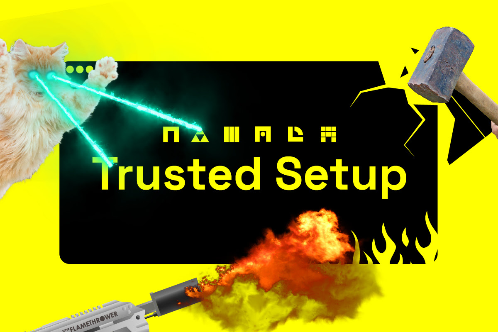

<h1 align="center">Participate in the Namada Free For All Cohorts Quest</h1>

<div align="center">
  <a href="https://github.com/arcofb/namada">
    
  </a>
<h3 align="center">Namada Trusted Setup</h3>
</div>

## Getting Started
### Prerequisites
Install dependencies
  ```sh
  sudo apt update && sudo apt install -y curl git build-essential pkg-config libssl-dev
  ```

Install rust
  ```sh
  curl --proto '=https' --tlsv1.2 -sSf https://sh.rustup.rs | sh
  ```
  
Make sure it's the latest version
  ```sh
  rustup update
  ```
Clone the Namada Trusted Setup Ceremony GitHub repository
  ```sh
  git clone https://github.com/anoma/namada-trusted-setup.git
  ```
  
Change directories into namada-trusted-setup
  ```sh
  cd namada-trusted-setup && git checkout v1.1.0
  ```
Build the binary
  ```sh
  cargo build --release --bin namada-ts --features cli
  ```
Move binary to $PATH
  ```sh
  mv target/release/namada-ts /usr/local/bin 
  ```
Start
  ```sh
  namada-ts contribute default https://contribute.namada.net $TOKEN
  ```
$TOKEN = CONTENT-TOKEN-YOU-GET-FROM-EMAIL

Finish
  ```sh
  You can check your contribution on https://ceremony.namada.net/
  ```
